# **📘 Balance API – DevOps Kubernetes Lab**

Simple TypeScript service used as a reference workload for a DevOps technical challenge.  
This repository demonstrates a full CI/CD and GitOps workflow using Docker, Kubernetes, ArgoCD and Kong Gateway.

---
## **🚀 Overview**

This project showcases an end-to-end DevOps flow:

- Develop a simple API in TypeScript
- Containerize it using Docker best practices
- Build & test it in CI
- Push image to a container registry
- Deploy to Kubernetes using GitOps (ArgoCD)
- Expose and control traffic via Kong API Gateway

The API itself is intentionally simple.  
The main goal is to demonstrate **automation, infrastructure as code, and delivery flow** from commit to production.

---
## **🧱 Tech Stack**

- Node.js
- TypeScript
- Express
- Jest (testing)
- ESLint (linting)
- Nodemon (local development)
- Docker (multi-stage builds)
- Kubernetes (Minikube)
- ArgoCD (GitOps)
- Kong Gateway (API Gateway)

---
## **🏗️ High Level Architecture**
Developer → GitHub → CI → Container Registry → ArgoCD → Kubernetes → Kong → Client

Flow description:

1. Developer pushes code to GitHub
2. CI pipeline builds and tests the API
3. Docker image is built and pushed to registry
4. Kubernetes manifests reference the image
5. ArgoCD syncs manifests into the cluster
6. Kong exposes the API with traffic control

---

**📂 Project Structure**
```
devops-lab-saldo-api/
├── .github/			     # CI Configuration
│   └── workflows/
│       └── ci-release.yml
│
├── app/                     # TypeScript API
│   ├── src/
│   │   ├── controllers/
│   │   ├── errors/
│   │   ├── middlewares/
│   │   ├── routes/
│   │   ├── services/
│   │   ├── types/
│   │   ├── utils/
│   │   ├── app.ts
│   │   └── server.ts
│   ├── __tests__/
│   ├── dist/
│   ├── Dockerfile
│   ├── package.json
│   ├── tsconfig.json
│   └── .env.example
│
├── argocd/
│   └── application.yaml
│
├── k8s/                     # Application IaC
│   ├── namespace.yaml
│   ├── deployment.yaml
│   ├── service.yaml
│   ├── hpa.yaml
│   ├── ingress.yaml
│   ├── rate-limit.yaml
│   └── kong/
│       ├── values.yaml      # Kong Helm values
│       └── tls/
│           ├── cluster-issuer.yaml
│           └── balance-cert.yaml
│
├── scripts/                 # Environment bootstrap
│   ├── setup-minikube.sh
│   ├── install-argocd.sh
│   ├── install-kong.sh
│   └── bootstrap.sh
│
├── .gitignore
└── README.md
```

---
## ⚡ **Quick Start** 

### ✅ Quick Start — One Command Setup

For a fresh machine, the full environment (Minikube, Argo CD, Kong) can be bootstrapped automatically using the provided scripts:
```
chmod +x scripts/*.sh
./scripts/bootstrap.sh
```

This will:
* Start Minikube and enable addons
* Install Argo CD via Helm
* Install Kong Gateway via Helm
* Prepare base namespaces
* Leave Argo CD ready to sync manifests from Git

After completion, you can access:
* Argo CD UI → https://localhost:8080
* API via Kong → minikube service kong-kong-proxy -n kong

This will open a local tunnel and output a URL like:
```
[kong kong-kong-proxy  http://127.0.0.1:58065
http://127.0.0.1:58066]
```

Then access the API using:
```
curl -k -H "Host: balance.local" https://127.0.0.1:58066/balance

The Host header is required because Kong routes traffic based on the Ingress host rule.
```

```
> ⚠️ Note: On Linux with VM-based drivers, it may be possible to access NodePorts
> directly via `<minikube-ip>:32443`, but this does not work with the Docker driver on macOS.
```

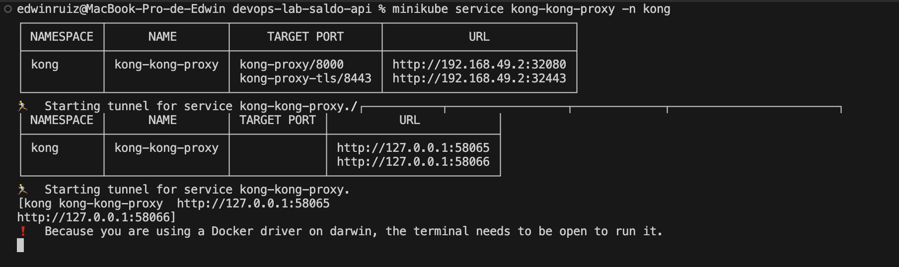

> ℹ️ **Kong Proxy URLs**
> 
> - The **first URL** corresponds to **HTTP** access (port 58065).
> - The **second URL** corresponds to **HTTPS** access with TLS enabled (port 58066).
> 
> Use the second one to test secure access to the API through Kong.

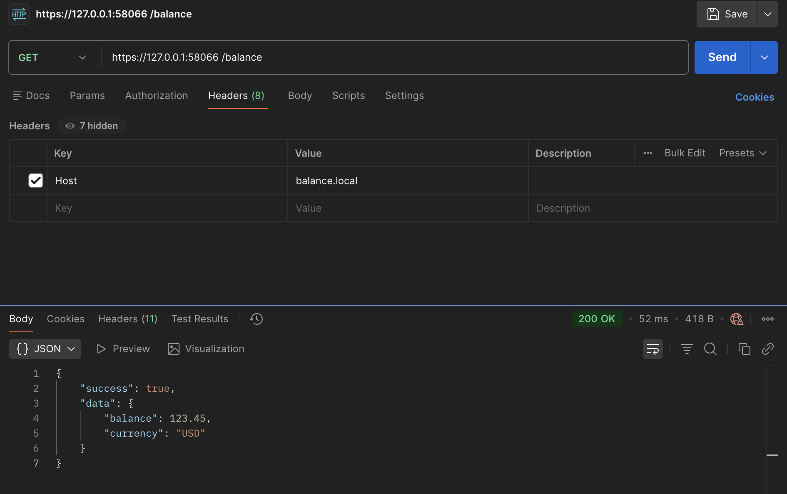
✔️ Recommended for reviewers who want a fast setup.

## **🔌 Detailed Manual Sections** 

```
> ⚠️ The following steps describe the process in detail for learning purposes.  
> For a quick setup, prefer using `./scripts/bootstrap.sh`.
```

**▶️ Run API Locally (Development)**
From the root:
```
cd app
npm install
npm run dev
```

**Endpoint**
API will be available at port 10000 by default:
```
http://localhost:10000/balance
```

Example response

```json
{
  "success": true,
  "data": {
    "balance": 123.45,
    "currency": "USD"
  }
}
```

**🧪 Run Tests**
```
npm test
```

**🧹 Run Lint**
```
npm run lint
```

---
## 🐳 Docker

The API is containerized using a **multi-stage Docker build** following container security and optimization best practices.

### ✅ Key Improvements & Practices

- **Multi-stage build**  
  Separates build-time dependencies from runtime to avoid shipping dev tools.

- **Single-file bundle**  
  The TypeScript app is bundled into a single `bundle.js` using `esbuild`, reducing runtime dependencies and attack surface.

- **Minimal runtime image (Chainguard)**  
  Uses `cgr.dev/chainguard/node` as a hardened runtime focused on security: no shell, no package manager, reduced OS surface, fewer CVEs, SBOM included, signed images, non-root by default.

- **Non-root execution**  
  The container runs as a non-root user by default (UID `65532`).

- **No dev dependencies in runtime**  
  Only the final JS artifact is copied into the runtime stage.

- **Optimized image size**  
  The compressed image pushed to the registry is ~55MB, keeping network and storage usage efficient.


---
### 📦 Build image
From the repository root:
```
docker build -t balance-api:local ./app
```
#### **▶️ Run container**
```
docker run -p 10000:10000 balance-api:local
```
**👤 Verify non-root execution**
```
docker inspect balance-api:local --format='{{.Config.User}}'
```
**📊 Check image size**
Uncompressed local size:
```
docker images | grep balance-api
```
Compressed size (as pushed to a registry):
```
docker save balance-api:local | gzip | wc -c
```

---
## 🔁 Continuous Integration (CI)

This project implements a complete **CI pipeline using GitHub Actions**. The pipeline is responsible for validating the code, running automated tests, building the Docker image using a multi-stage Dockerfile, and publishing it to **GitHub Container Registry (GHCR)**.

### 🎯 CI Objectives

The CI pipeline ensures that:

- ✅ Dependencies are installed
- 🧪 Automated tests are executed
- 🐳 The Docker image is built using a multi-stage build (Chainguard base images)
- 📦 The image is pushed to GitHub Container Registry
- 🏷️ Images are versioned using Git tags (semantic versioning)

This guarantees that only tested and validated images are released.
### ⚙️ Trigger Strategy

The pipeline is triggered **only when a Git tag is pushed** that matches the pattern:
```
git tag v0.1.1
git push origin v0.1.1
```

### 🗂️ Workflow Location

GitHub automatically detects workflows located at:
```
.github/workflows/ci-release.yml
```

### 🐳 Docker Image Versioning

Each image is tagged automatically using the Git tag that triggered the pipeline:
```
ghcr.io/<github-username>/<repository>:<git-tag>
```
Example:
```
ghcr.io/lebard504/devops-lab-saldo-api:v0.1.1
```

### 📦 GitHub Container Registry (GHCR)
* Images are published to **GitHub Container Registry**
* The registry is integrated natively with GitHub
* Authentication is handled using the built-in GITHUB_TOKEN
* No additional secrets are required
* Images are public for easy consumption in Kubernetes

You can view published images at:
```
https://github.com/lebard504/devops-lab-saldo-api/pkgs/container/devops-lab-saldo-api
```

**🔄 CI Flow Summary**
```
Git Tag Push (vX.Y.Z)
        │
        ▼
GitHub Actions CI Pipeline
        │
        ├── Checkout code
        ├── Install dependencies
        ├── Run tests
        ├── Build Docker image
        ├── Push image to GHCR
        ├── Update Kubernetes manifest with new tag
        └── Commit & push manifest to repo
        │
        ▼
GitOps CD with Argo CD
        │
        ├── Detects change in k8s/ manifests
        ├── Auto-sync enabled
        └── Applies new image to cluster
        │
        ▼
Kubernetes Deployment updated automatically
```

### ✅ Outcome

With this CI/CD pipeline in place:
* Only tested code is released
* Images are versioned and traceable via Git tags
* Kubernetes manifests are updated automatically by CI
* Argo CD applies changes using GitOps principles
* No manual kubectl apply needed for deployments

---
## **🚀 Manual Local Setup Guide (Minikube + ArgoCD)**

### 🧰 Prerequisites
* Docker
* kubectl
* Minikube
* Helm
* Git

**▶️ 1. Start Minikube**
```
minikube start
```

Enable metrics server (needed for HPA):
```
minikube addons enable metrics-server
```

**⚙️ 2. Install Argo CD with Helm**
```
kubectl create namespace argocd

helm repo add argo https://argoproj.github.io/argo-helm
helm repo update

helm install argocd argo/argo-cd -n argocd
```

Verify:
```
kubectl get all -n argocd
```

**🔐 3. Access Argo CD UI**

Port-forward:
```
kubectl port-forward svc/argocd-server -n argocd 8080:443
```

Get admin password:
```
kubectl get secret argocd-initial-admin-secret -n argocd \
  -o jsonpath="{.data.password}" | base64 --decode && echo
```

Login at:
👉 https://localhost:8080
User: admin

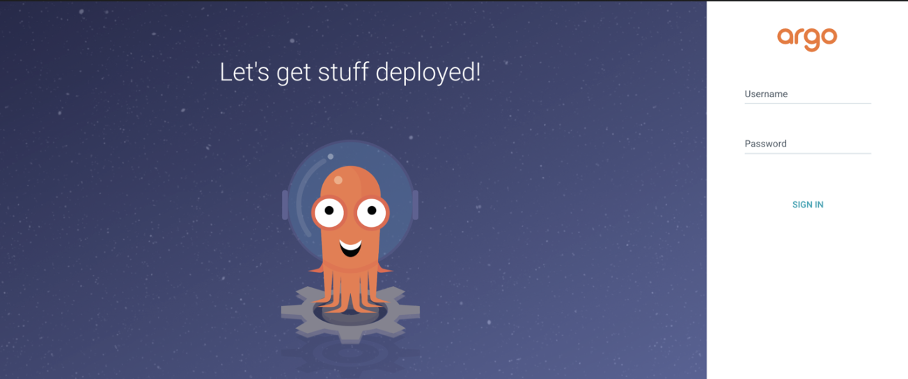

**📦 4. Create namespace for app**
```
kubectl create namespace balance
```

**🔑 5. Create GHCR image pull secret**
⚠️ In real scenarios, never commit tokens. Use GitHub secrets or PAT with read:packages.
```
kubectl create secret docker-registry ghcr-secret \
  --docker-server=ghcr.io \
  --docker-username=lebard504 \
  --docker-password={GHCR_TOKEN} \
  --docker-email=lebard504@gmail.com \
  -n balance
```

Verify:
```
kubectl get secret ghcr-secret -n balance
```
Inspect (optional):
```
kubectl get secret ghcr-secret -n balance -o yaml

kubectl get secret ghcr-secret -n balance \
  -o jsonpath='{.data.\.dockerconfigjson}' | base64 --decode
```

**📄 6. Register ArgoCD Application**
Apply:
```
kubectl apply -f argocd/application.yaml
```

This Application:
* Watches k8s/ folder
* Auto-sync enabled
* Self-heal enabled

Verify in UI → Application should appear as **Synced & Healthy**.
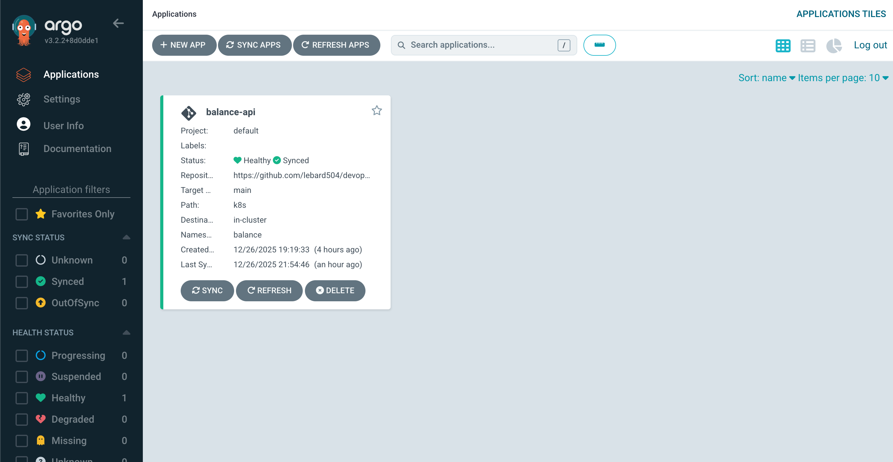
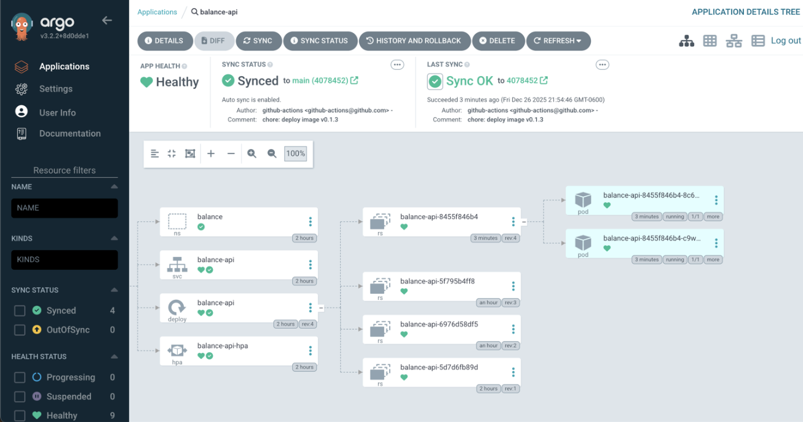

**🌐 7. Access the API locally**
```
kubectl port-forward svc/balance-api -n balance 9090:80
```

Test:
```
curl --location 'http://localhost:9090/balance'
```

**📈 8. Validate HPA & Metrics**
```
kubectl get hpa -n balance
kubectl describe hpa balance-api-hpa -n balance

kubectl top pods -n balance
```

**🔥 9. Generate Load to Trigger Autoscaling**
```
kubectl run -it --rm loadgen --image=busybox -n balance -- sh
```
Inside pod:
```
while true; do wget -q -O- http://balance-api.balance.svc.cluster.local; done
```
Watch scaling:
```
kubectl get hpa -n balance -w
kubectl get pods -n balance -w
```

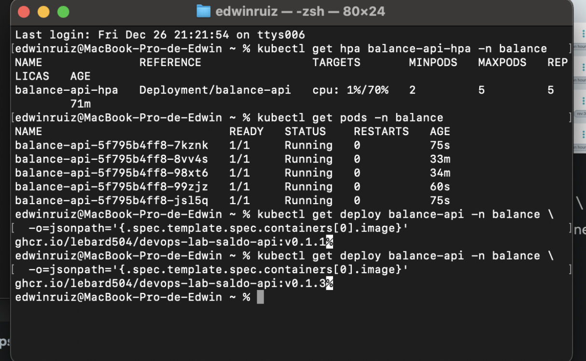

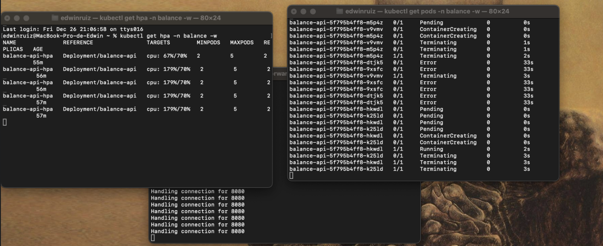
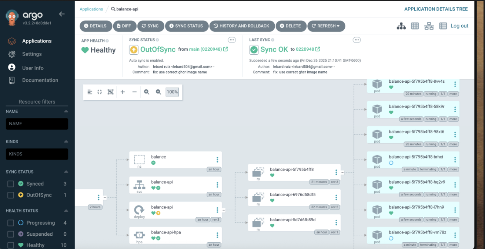

**🔄 10. Manual scale test (optional)**
```
kubectl scale deploy balance-api -n balance --replicas=2
```

**🏷️ 11. Release a New Version (CI/CD Test)**
Example:
```
git tag v0.1.4
git push origin v0.1.4
```

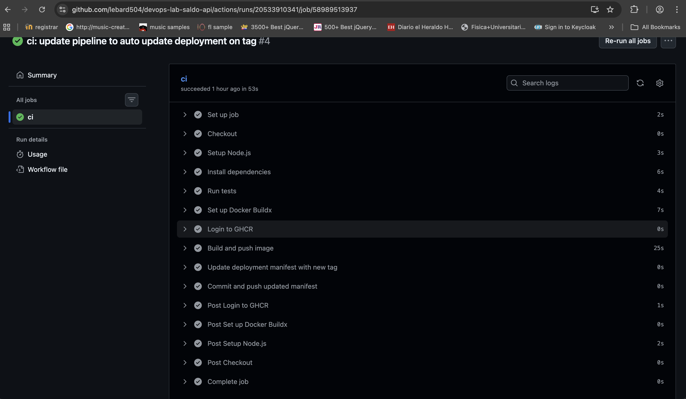
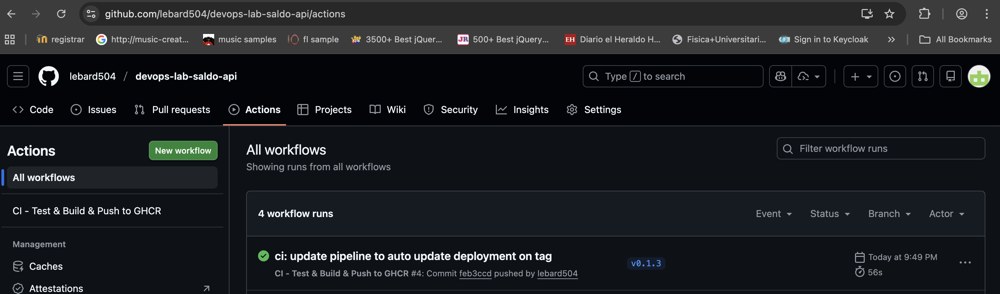

This will:
* Trigger GitHub Actions
* Build & push image to GHCR
* Update k8s/deployment.yaml
* Commit change
* ArgoCD auto-syncs
* New pods roll out automatically

Verify:
```
kubectl get deploy balance-api -n balance \
  -o jsonpath='{.spec.template.spec.containers[0].image}'
```

---
## **🚪 Kong API Gateway & Ingress Controller**

In this phase, **Kong Gateway** is introduced as the **Ingress Controller and API Gateway** for the balance-api service.
Kong is responsible for:
	🌐 Exposing the API via HTTPS
	🚦 Applying rate limiting at the gateway level
	🔌 Acting as the single entry point to the cluster

Kong is installed and managed using **Helm**.

### 📦 Install Kong with Helm

Add the Kong Helm repository and install it into the kong namespace:
```
helm repo add kong https://charts.konghq.com
helm repo update

kubectl create namespace kong

helm install kong kong/kong \
  -n kong \
  -f k8s/kong/values.yaml
```

The values.yaml file configures:
* Kong as Ingress Controller
* Proxy service exposure (HTTP/HTTPS)
* TLS support
* Minimal footprint for local lab usage

**🔍 Verify Kong Installation**
```
kubectl get pods -n kong
kubectl get svc -n kong
```

🔐 HTTPS Exposure

The Ingress is configured with TLS:
```
tls:
  - hosts:
      - balance.local
    secretName: balance-tls
```
This enables HTTPS termination at Kong using the balance-tls certificate secret.

⚠️ cert-manager is required for TLS:
```
helm repo add jetstack https://charts.jetstack.io
helm repo update
helm install cert-manager jetstack/cert-manager \
  --namespace cert-manager --create-namespace \
  --set installCRDs=true
```
### ⚙️ Apply Gateway Manifests

Once Kong is running, apply the gateway-related manifests:
```
kubectl apply -f k8s/rate-limit.yaml
kubectl apply -f k8s/ingress.yaml
```

These resources define:
* A KongPlugin for rate limiting
* An Ingress resource that routes traffic to balance-api

**🔎 Verify Gateway Resources**
```
kubectl get ingress -n balance
kubectl get kongplugin -n balance
```
Inspect the Ingress:
```
kubectl describe ingress balance-api-ingress -n balance
```

**🌍 Expose Kong Locally (Minikube)**
```
minikube service kong-kong-proxy -n kong
```
This will output URLs like:
```
http://127.0.0.1:<PORT>
https://127.0.0.1:<PORT>
```
⚠️ On macOS with Docker driver, the terminal must remain open to keep the tunnel alive.

**🧪 Test the API Through Kong**
Using the URL provided by Minikube (example):
```
http://127.0.0.1:<PORT>
```
Send requests with the proper Host header:
```
for i in {1..10}; do
  curl -i -H "Host: balance.local" http://127.0.0.1:<PORT>/balance
done
```
After exceeding the configured threshold, Kong will respond with:
```
HTTP/1.1 429 Too Many Requests
```

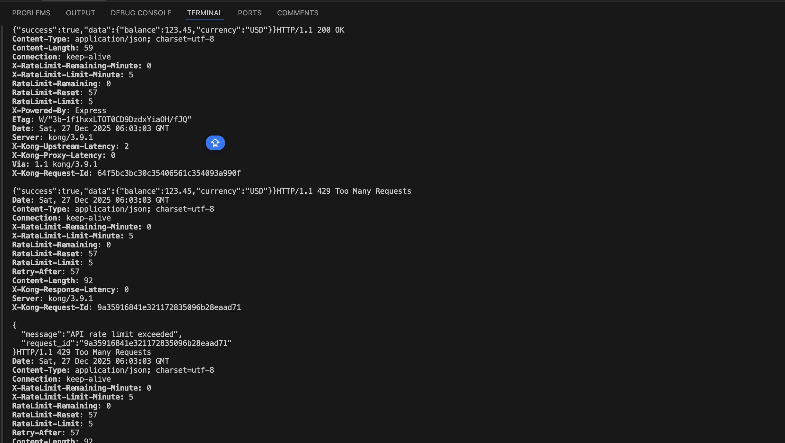
This confirms that **rate limiting is enforced at the gateway level**.

### 🧩 Gateway Manifests Involved
* k8s/kong/values.yaml → Kong Helm configuration
* k8s/ingress.yaml → Ingress with Kong class and TLS
* k8s/rate-limit.yaml → Kong rate limiting plugin

### ✅ Outcome

With Kong in place:
✔️ API is exposed through a single gateway
✔️ HTTPS is enabled at the edge
✔️ Rate limiting protects the backend service
✔️ Kong is managed via Helm
✔️ Fully integrated with Kubernetes & GitOps

---
## 🏗️ Infrastructure as Code (IaC) – k8s/ Folder

This repository follows an **Infrastructure as Code** approach: the full Kubernetes runtime configuration for the API is defined as declarative YAML inside k8s/.
**Git is the single source of truth** for the desired cluster state, and **Argo CD continuously reconciles** the cluster against these manifests.

### 📁 k8s/ contents

**1) namespace.yaml**
Creates the namespace where the workload runs.
* **Namespace**: balance
* Reason: isolates app resources from argocd and other workloads.

**2) deployment.yaml**
Defines how the API is executed inside the cluster.
* Deploys **2 replicas** by default (can be controlled by HPA)
* Uses imagePullSecrets: ghcr-secret to pull from GHCR
* Container exposes containerPort: 10000
* Resource requests/limits are defined to support predictable scheduling and autoscaling

Key point:
* The **image tag is pinned** (e.g., ghcr.io/lebard504/devops-lab-saldo-api:vx.x.x) to ensure reproducible deployments.
* CI can update this tag automatically by committing changes back into k8s/deployment.yaml.

**3) service.yaml**
Exposes the Deployment internally using a stable DNS name.
* Type: ClusterIP
* Port: 80
* Target: container 10000

This enables:
* In-cluster access via:
http://balance-api.balance.svc.cluster.local
* Local testing via:
  kubectl port-forward svc/balance-api -n balance 9090:80

**4) hpa.yaml**
Adds autoscaling based on CPU utilization.
* Scales the Deployment when CPU crosses the target threshold
* Example configuration:
* minReplicas: 2
* maxReplicas: 5
* targetCPUUtilizationPercentage: 70 *(or 50% if required by the challenge)*

Note: HPA requires the **metrics-server** addon enabled in Minikube.

**5) ingress.yaml**
Defines external access to the API through Kong.
* Uses ingressClassName: kong
* Routes host balance.local and path /balance to the balance-api service
* Enables TLS termination at the gateway

This allows clients to reach the API via Kong instead of directly to the Service.

**6) rate-limit.yaml**
Defines a KongPlugin to apply rate limiting at the gateway level.
* Example policy: limit requests per minute
* Protects backend pods from abuse
* Enforced before traffic reaches the service

This demonstrates **API traffic control at the edge**.

**7) kong/values.yaml**
Helm configuration used to install and customize **Kong Gateway** itself.
This file is part of the IaC because it defines how the gateway runs in Kubernetes.

Main responsibilities:
* Enables Kong as **Ingress Controller**
* Runs Kong in **DB-less mode**
* Exposes HTTP/HTTPS via **NodePort**
* Disables admin/manager interfaces for security

Key sections:
* **Runtime (DB-less)**
```
env:
  database: "off"
  nginx_worker_processes: "1"
  proxy_listen: "0.0.0.0:8000, 0.0.0.0:8443 ssl http2"
```
* **Ingress Controller**
```
ingressController:
  enabled: true
  installCRDs: true
```
* **Proxy exposure**
```
proxy:
  enabled: true
  type: NodePort
  http:
    enabled: true
    servicePort: 8000
    nodePort: 32080
  tls:
    enabled: true
    servicePort: 8443
    nodePort: 32443
```
* **Hardened setup**
```
admin:
  enabled: false

manager:
  enabled: false
```

This ensures:
* Kong is fully managed via Kubernetes CRDs and GitOps
* HTTPS is available at the gateway
* Minimal and secure footprint for the lab

**Explanation:**
* Exposes Kong outside the cluster using **NodePort** (ideal for Minikube).
* Ports:
* 32080 → HTTP
* 32443 → HTTPS
* Internally maps to Kong ports 8000 and 8443.

This allows access like:
```
http://<minikube-ip>:32080
https://<minikube-ip>:32443
```

**8) kong/tls/**
Defines the TLS infrastructure used by Kong to terminate HTTPS traffic for the API using **cert-manager**.

This folder contains two manifests:
**1. cluster-issuer.yaml**
Defines a ClusterIssuer that issues self-signed certificates for the lab environment:
```
apiVersion: cert-manager.io/v1
kind: ClusterIssuer
metadata:
  name: selfsigned-issuer
spec:
  selfSigned: {}
```

Purpose:
* Acts as the certificate authority for the cluster
* Allows cert-manager to generate certificates without external dependencies (ideal for local Minikube labs)

**2. balance-cert.yaml**
Requests a TLS certificate for the domain balance.local and stores it as a Kubernetes Secret:
```
apiVersion: cert-manager.io/v1
kind: Certificate
metadata:
  name: balance-cert
  namespace: balance
spec:
  secretName: balance-tls
  issuerRef:
    name: selfsigned-issuer
    kind: ClusterIssuer
  dnsNames:
    - balance.local
```
Purpose:
* Creates the balance-tls Secret in the balance namespace
* This Secret contains the generated certificate and private key
* It is referenced by ingress.yaml for HTTPS termination in Kong

Relationship with **Ingress**:
In k8s/ingress.yaml:
```
tls:
  - hosts:
      - balance.local
    secretName: balance-tls
```

This tells Kong to:
* Use the certificate stored in balance-tls
* Terminate HTTPS at the gateway for balance.local

Result:
✔️ TLS is managed declaratively
✔️ Certificates are auto-generated by cert-manager
✔️ Kong terminates HTTPS using Kubernetes Secrets
✔️ No manual cert creation required

> 🔐 Note: Self-signed certificates are used for lab purposes only.  
> In production, this should be replaced with a trusted issuer (e.g., Let's Encrypt).

---
### 🔁 GitOps Reconciliation with Argo CD

Argo CD is configured to watch the k8s/ folder and continuously reconcile it into the cluster.
* **Observed path**: k8s/
* **Sync policy**: automated
* **Self-heal**: enabled
* **Prune**: enabled (removes resources deleted from Git)

The Argo CD Application manifest is stored at:
* argocd/application.yaml

It points to:
* repoURL: https://github.com/lebard504/devops-lab-saldo-api.git
* targetRevision: main
* path: k8s

This ensures:
* Any change committed into k8s/ becomes the new desired state
* Argo CD applies it automatically without manual kubectl apply

### ✅ Benefits of this approach
* Full environment defined as code
* Reproducible and auditable deployments
* Git is the source of truth
* Automatic reconciliation via Argo CD
* Clear separation between CI (build) and CD (deploy)

---
### 🛡️ Why Chainguard instead of Alpine?

Although node:alpine can be slightly smaller in uncompressed size, Chainguard images are chosen because they:
* Are **hardened by default**
* Contain **no package manager or shell**
* Have a **reduced attack surface**
* Provide **SBOM and provenance**
* Run as **non-root by default**
This prioritizes **security and supply-chain integrity** over raw image size, aligning with production-grade container best practices.

---
### 🎯 Goal of This Lab

This repository will be extended to include:
* CI pipeline (GitHub Actions)
* Image publishing to registry
* Kubernetes manifests
* ArgoCD Application definition
* Kong Ingress configuration
* Rate limiting and security controls

Each step will be committed incrementally to show the full DevOps lifecycle.

---
### 📌 Status

✅ API implemented
✅ TypeScript setup
✅ Tests, lint, nodemon
✅ Dockerized API
✅ CI pipeline
✅Kubernetes manifests
✅ ArgoCD integration
✅ Kong Gateway setup

---
**👤 Author**
DevOps Lab by Edwin Rafael Sánchez Ruiz